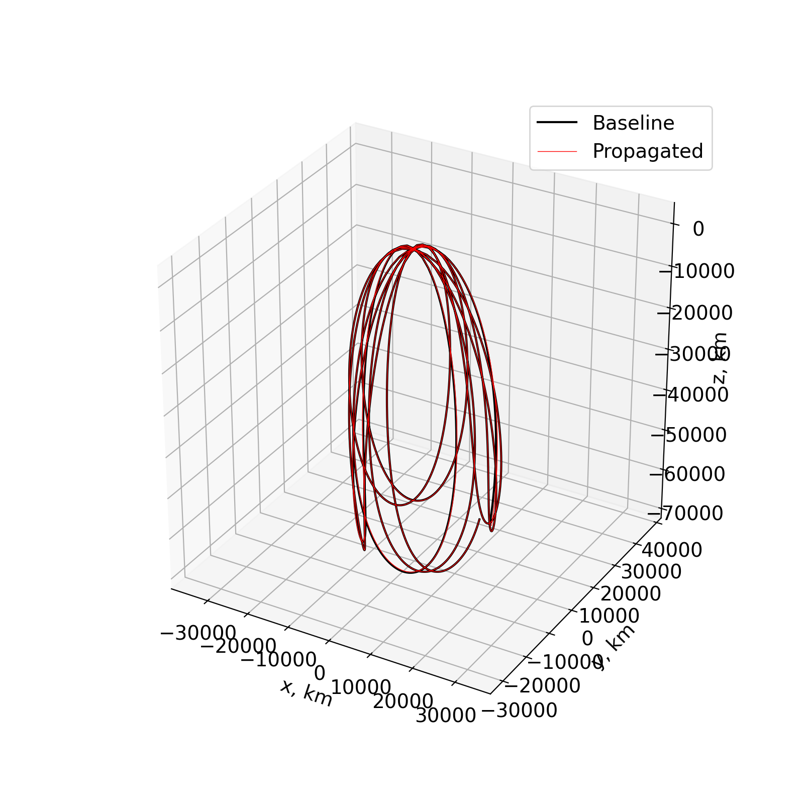

.. paladin documentation master file, created by
   sphinx-quickstart on Wed Jun 26 00:24:21 2024.
   You can adapt this file completely to your liking, but it should at least
   contain the root `toctree` directive.

Welcome to `paladin`'s documentation!
========================================

`paladin` is a Python package for high-fidelity propagation of spacecraft translational dynamics. 
The propagation is done with GSL under the hood. 

.. toctree::
   :maxdepth: 2
   :caption: Contents:

   start
   example_propagate
   api

Indices and tables
==================

* :ref:`genindex`
* :ref:`modindex`
* :ref:`search`
